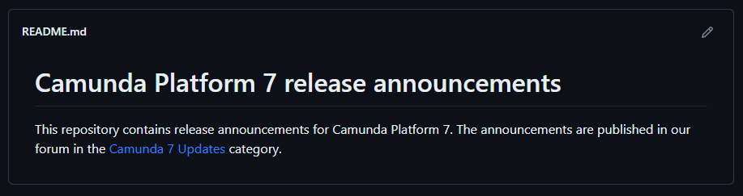

We are pleased to announce the next alpha release of **Camunda Automation Runtime 7.20**. This release features the following improvements:

* Feature 1
* Feature 2
* [XX Bug Fixes](https://github.com/camunda/camunda-bpm-platform/issues?q=is%3Aissue+is%3Aclosed+label%3Aversion%3A7.20.0-alpha5+label%3Atype%3Abug)

You can [Download Camunda for free](https://camunda.com/download/) or [Run it with Docker](https://hub.docker.com/r/camunda/camunda-bpm-platform/).

For a complete list of all improvements, take a look at the [release notes](https://github.com/camunda/camunda-bpm-platform/issues?q=is%3Aissue+is%3Aclosed+label%3Aversion%3A7.20.0-alpha5). Please also see the list of [known issues](https://github.com/camunda/camunda-bpm-platform/issues?q=is%3Aissue+is%3Aopen+label%3Aversion%3A7.20.0+label%3Atype%3Abug).

If you want to dig deeper, you can find the source code on [GitHub](https://github.com/camunda/camunda-bpm-platform/releases/tag/7.20.0-alpha5).

## Feature 1

Content

## Feature 2

Content

## Share your thoughts with us!

Your feedback is vital to us, so please download **Camunda Automation Platform 7.20.0-alpha5**, try it out, and let us know your thoughts.

You can contact us in the [forum](https://forum.camunda.io/), send a tweet to [@Camunda](https://twitter.com/Camunda), or file a bug in [our issue tracker](https://github.com/camunda/camunda-bpm-platform/issues).
